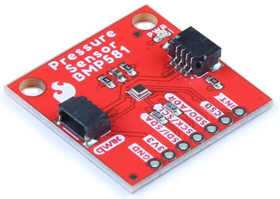

BMP581 Temperature+Pressure Sensor
===========================================

.. seo::
    :description: Instructions for setting up BMP581 temperature and pressure sensors with ESPHome
    :image: bmp581.jpg
    :keywords: BMP581

The ``bmp581`` sensor platform allows you to use your BMP581 
(`datasheet <https://www.bosch-sensortec.com/media/boschsensortec/downloads/datasheets/bst-bmp581-ds004.pdf>`__, `SparkFun <https://www.sparkfun.com/products/20170>`__) temperature and pressure sensors with ESPHome. The :ref:`I²C <i2c>` bus is
required to be set up in your configuration for this sensor to work.

    BMP581 Temperature and Pressure Sensor.
    (Credit: `SparkFun <https://www.sparkfun.com/products/20170>`__, image cropped and compressed)

.. code-block:: yaml

    # Example configuration entry
    sensor:
      - platform: bmp581
        temperature:
          name: "Indoor Temperature"
          oversampling: 16x
        pressure:
          name: "Indoor Pressure"
        address: 0x47
        update_interval: 60s

Configuration variables:
------------------------

- **temperature** (*Optional*): The information for the temperature sensor.

  - **name** (**Required**, string): The name for the temperature
    sensor.
  - **oversampling** (*Optional*): The oversampling parameter for the temperature sensor.
    See :ref:`Oversampling Options <bmp581-oversampling>`.
  - **iir_filter** (*Optional*): The Infinite Impulse Response Filter level for the temperature sensor.
    See :ref:`Infinite Impulse Response Filter Options <bmp581-iir>`.
  - **id** (*Optional*, :ref:`config-id`): Set the ID of this sensor for use in lambdas.
  - All other options from :ref:`Sensor <config-sensor>`.

- **pressure** (*Optional*): The information for the pressure sensor.

  - **name** (**Required**, string): The name for the pressure sensor.
  - **oversampling** (*Optional*): The oversampling parameter for the pressure sensor.
    See :ref:`Oversampling Options <bmp581-oversampling>`.
  - **iir_filter** (*Optional*): The Infinite Impulse Response Filter level for the pressure sensor.
    See :ref:`Infinite Impulse Response Filter Options <bmp581-iir>`.
  - **id** (*Optional*, :ref:`config-id`): Set the ID of this sensor for use in lambdas.
  - All other options from :ref:`Sensor <config-sensor>`.

- **address** (*Optional*, int): Manually specify the I²C address of
  the sensor. Defaults to ``0x46``. Another address can be ``0x47``.
- **update_interval** (*Optional*, :ref:`config-time`): The interval to check the
  sensor. Defaults to ``60s``.

.. _bmp581-oversampling:

Oversampling Options
--------------------

By default, the BMP581 sensor measures the pressure 16 times and temperature once when requesting a new value to reduce measurement noise. You can, however,
configure this amount. Possible oversampling values:

-  ``NONE`` (value is skipped, default for temperature)
-  ``2x``
-  ``4x``
-  ``8x``
-  ``16x`` (default for pressure)
-  ``32x``
-  ``64x``
-  ``128x``

The datasheet gives suggestions for oversampling combinations:

.. list-table:: Oversampling Settings
  :header-rows: 1 

  * - Oversampling setting
    - Pressure oversampling
    - Temperature oversampling
  * - Lowest power
    - ``NONE``
    - ``NONE``
  * - 
    - ``2x``
    - ``NONE``
  * - Standard resolution
    - ``4x``
    - ``NONE``
  * -
    - ``8x``
    - ``NONE``
  * - High resolution (default)
    - ``16x``
    - ``NONE``
  * -
    - ``32x``
    - ``2x``
  * -
    - ``64x``
    - ``4x``
  * - Highest resolution
    - ``128x``
    - ``8x``

.. note::

    Increasing oversampling settings increases the time it takes for the sensor to measure temperature and pressure. With no oversampling enabled, the measurement time is approximately 3 ms. If temperature and pressure oversampling are both set to ``128x``, then the measurement time is approximately approximately 107 ms. The component takes this into timing into account, but if you require very frequent measurements or want to reduce power consumption, then consider using lower oversampling rates.

.. _bmp581-iir:

Infinite Impule Response Filter Options
---------------------------------------

The BMP581's Infinite Impule Response filter reduces noise in measurement values due to ambient conditions; e.g., a door slamming or a window opening. By default,
IIR filter is disabled for both the temperature and pressure sensors, but you can configure the amount of filtering for the temperature and pressure sensors separately. Possible IIR filter values:

- ``OFF`` (default)
-  ``2x``
-  ``4x``
-  ``8x``
-  ``16x``
-  ``32x``
-  ``64x``
-  ``128x``

.. warning::

    If the IIR filter is enabled for either the temperature or pressure sensor, then the BMP581's deep standby mode is disabled. This will increase the sensor's power consumption, so if you are using a long update interval; e.g., more than 0.2 updates per second, then consider using the mathematically equivalent ESPHome exponential filter instead of the IIR interal filter to reduce power consumption. See :ref:`exponential moving average filter<sensor-filter-exponential_moving_average>` for information.

See Also
--------

- :ref:`sensor-filters`
- :doc:`bme280`
- :doc:`bmp280`
- :doc:`bmp3xx`
- :doc:`bme680`
- :doc:`bmp085`
- `BMP5 sensor API <https://github.com/boschsensortec/BMP5-Sensor-API>`__
- :ghedit:`Edit`
